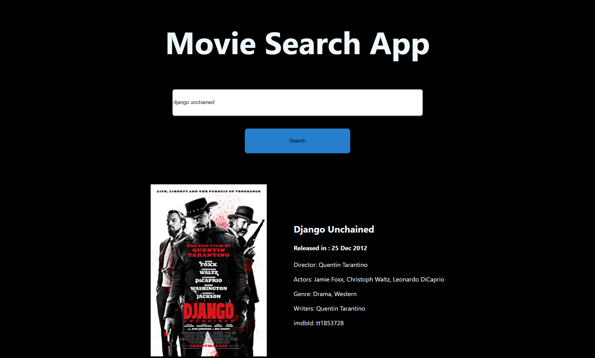

# Description
This is a react project made to search for a movie with the movie name, it is case insensitive. The project uses the API of OMDB to fetch the results. The project was build with an aim to understand Api handling of different types.

## SnapShot of Project

## Available Scripts

You will have to add your key to the .env.local file and run the project for it to work.
In the project directory, you can run:

### `npm start` 
to start the app

### `npm run build`

Builds the app for production to the `build` folder.\
It correctly bundles React in production mode and optimizes the build for the best performance.

The build is minified and the filenames include the hashes.\
Your app is ready to be deployed!

See the section about [deployment](https://facebook.github.io/create-react-app/docs/deployment) for more information.

### `npm run eject`
